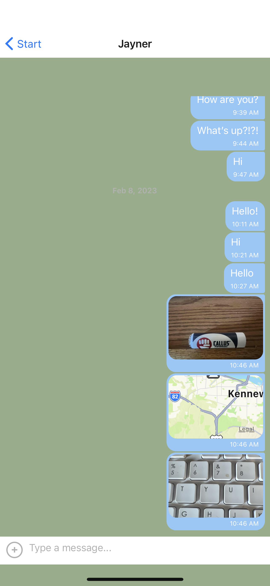

# Chat App
A native chat app built with React Native. The app provides users with a chat interface and options to share images and their location.

 
 
 ## Intro
 Chat App for both Android/iOS created with React Native.

 ## Tech Stack
 Technologies being used:
 - React Native
 - Expo
 - Firebase
 - Gifted Chat library

 ## User Stories
 - As a new user, I want to be able to easily enter a chat room so I can quickly start talking to my friends and family.
 - As a user, I want to be able to send messages to my friends and family members to exchange the latest news.
 - As a user, I want to send images to my friends to show them what I’m currently doing.
 - As a user, I want to share my location with my friends to show them where I am.
 - As a user, I want to be able to read my messages offline so I can reread conversations at any time.

 ## Running the Project
### Prerequisites
- Install [Expo](https://expo.dev/) `npm install expo-cli -g`.
- Download the [Expo Go App](https://expo.dev/client) on your mobile device from the Google Play Store or the Apple Store.
- Windows and Linux Users: Install [Android Studio](https://developer.android.com/studio).
- Mac Users: Install [Xcode](https://developer.apple.com/xcode/).

### Get Started
- Install all dependencies by running `npm i`.
- Start the app by running `npm start` or `expo start`.
- On the Expo Go App, launch the chat-app by scanning the QR code shown in your terminal
- On an emulator, launch the chat-app by pressing "Run on Android device / emulator

### Data storage (Firestore)
- Sign in at [Google Firebase/Firestore](https://firebase.google.com/) 
- Go to console, start in test mode
- Settings/General/Your apps => Click "Firestore for Web" and copy the contents of the `config` object.
- In app file Components/Chat.js, replace Firebase config data with the copied credentials

> Chat.js
>
> ```javascript
> firebase.initializeApp({
>   apiKey: 'your-api-key',
>   authDomain: 'your-authdomain',
>   databaseURL: 'your-database-url',
>   projectId: 'your-project-id',
>   storageBucket: 'your-storage-bucket',
>   messagingSenderId: 'your-messaging-sender-id',
>   appId: 'your-app-id',
> });